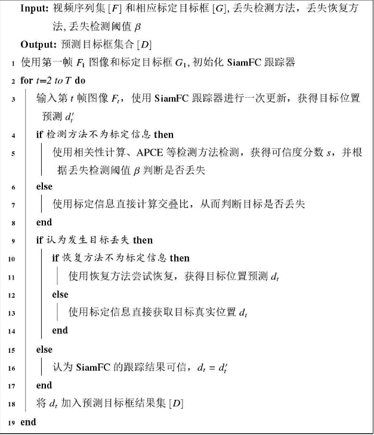
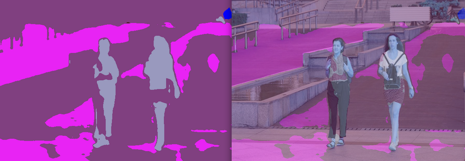
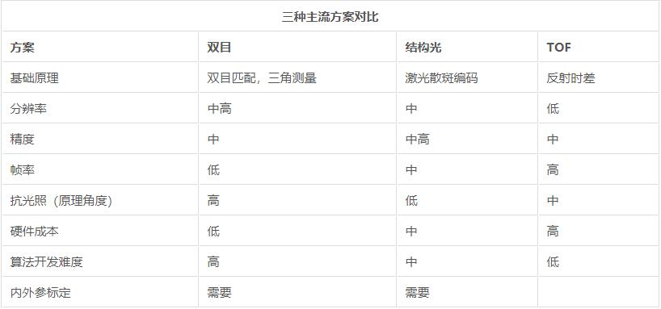

# MY THOUGHTS

## Questions

### 任务是什么？

1. 改写寻路（避障）算法
2. 追加目标追踪模块
3. 集群编队飞行
4. 结合目标追踪和避障模块（增设吊舱移动功能）

### 主要难点？

1. 真机移植，会有很多细节问题要处理
2. 搞清楚关键话题，比如地图、速度控制，在此基础上移植
3. 在模拟中，如果能把gazebo的世界直接转化成点云，就可以构建很多复杂的地图用于测试
   - 在网上找到个[开源包](https://github.com/laboshinl/loam_velodyne)，可以转化
4. 结合的难点
   1. 寻路算法会在rviz里给出目标点，也就是说提前知道了全局地图，但是目标追踪似乎不需要全局地图
   2. 
5. 目标追踪模块需要安装一大堆驱动
6. siamRPN需要事先手动框选目标，有没有办法避免？
7. siamRPN和YOLO为什么要结合使用？分工是什么
   - 是不是可以用YOLO自动框选出目标，再由siamRPN追踪？
   - 实际上siamRPN的输出和YOLO很类似，但是YOLO会辨认出它识别出的目标，siamRPN则会不断地在周围寻找最初框选的目标
8. 训练YoloV5模型的时候出现问题，模型无法识别
   1. 更改了Cuda版本，无效
   2. 改为cpu训练和推理，无效
   3. 推测是数据集的问题，打算更改一下数据集再测试
   4. 已解决，是训练轮次不够
9. 把我和tty的数据放一起训练，会导致识别不出tty，推测原因是我拍的角度变化比较大（对于人脸应该尽量从正面采集数据？）

### 一些疑惑

1. local_planner和global_planner的关系是什么？
2. 全局地图更新和局部地图更新有啥区别？
   - 由slam生成的是全局地图，由传感器获取的是局部地图
3. 源码里面还有一个2D雷达的规划方式，又是什么情况
4. global_planner里面也分为gloabal_point和local_point，二者有什么区别

## Points

### 已知信息

1. gazebo负责提供模拟数据
2. rviz通过把真实的地图抽象成点云提供可视化（也就是无人机视角里的世界）
3. fast-lab的项目没用到rviz，直接随机生成了点云
4. 寻路算法都要依赖点云进行计算
5. fast-lab的算法在点云的基础上进一步抽象成栅格地图，不过那是算法的实现细节
6. Prometheus的避障算法基本都是定高飞行，fast-lab实现了z轴上的飞行
7. Prometheus的local_planner是一个父类，apf和vfh分别实现了它的compute_force函数，从而实现了不同的规划算法，其中apf简单地把引力和斥力的和作为期望速度

### 源码改动

1. Modules/common/CMakeLists.txt
2. darknet_ros部分
3. prometheus_msg部分
4. object_detection的CMakeLists，注释掉ellipse和sample部分
5. 修改YoloDetector.cpp .hpp内容
6. 修改CheckForObjects.action的内容
7. 在Yolo+SiamRPN中，把YoloV5单独启动为一个Client，通过TCP传递数据，并把数据转为相应的.msg格式，在点击了追踪目标后，无人机将启用SiamRPN追踪该目标
8. 使用YOLO作为目标检测，siamRPN作为目标跟踪
   1. 事先标定相机参数,并提供目标的大致大小,根据目标在镜头中的大小可以估算出距目标的距离
   2. 当连续一段时间无法检测到目标时，认定目标丢失
   3. demo里直接根据距离给出速度了,我们应该加入避障的模块
   4. 由siam_rpn.py发布`/prometheus/object_detection/siamrpn_tracker`话题，并由siamrpn_tracker.cpp接受
10. 摄像头输入的数据会由一个CvBridge的包处理成为cv2格式的图片
11. 话题`/uav/pometheus/state`中的attitude和attitude_q是描述无人机俯仰角和朝向的
12. 有关目标丢失的策略
    1.  
13. 在论文《基于点云的三维多目标追踪与目标检测算法研究》（DOI:10.27162/d.cnki.gjlin.2022.003464)中提到了根据点云追踪的方法
14. YoloV5的训练过程
    1.  准备数据集
    2.  在data目录下写好该数据集的相关yaml文件，主要内容是种类数量及名字,数据集的路径
    3.  配置train.py的参数
      - --weights，预训练模型pt文件的路径
      - --cfg，预训练模型的yaml文件路径
      - --data，第二步yaml文件的路径
      - --epochs，训练轮次
      - --batch_size，根据显卡的显存决定
      - --workers，线程数，根据CPU决定
15. YoloV5的推理测试
    1.  配置detect.py的参数
      - --weights，pt文件的路径，当然也可以是wts文件
      - --save-dir，保存路径
      - --source，要检测的文件或文件夹，为0代表摄像头输入
      - --save-txt
      - --device，数字代表显卡序号，单显卡为0，也可以写'cpu'
16. [ComplexYolo](https://github.com/maudzung/Complex-YOLOv4-Pytorch)
    1.  输入3D点云经过降维而成的2D鸟瞰图，先将三维点云进行栅格化，将点集分布到鸟瞰图空间的网格中，然后编码网格内点集的最大高度，最大强度，点云密度三种信息归一化后分别填充到R，G，B三个通道中形成RGB-Map(获取鸟瞰图（BEV）rgb_map：由强度图intensityMap（608x608）、高度图heightMap（608x608）和密度图densityMap（608x608）共同组成3x608x608维度的鸟瞰图，类似于3通道的RGB图片)然后采用YOLOv2的Darknet19进行特征提取并回归出目标的相对中心点（不直观，点云预处理需要时间）
    2.  将x、y、w、l、rz转换成yolo格式，其中rz用欧拉公式转换为虚部（im）和实部（re）。这样最终真实标签target由8个维度组成，即batch_id、class_id、x、y、w、l、im、re
    3.  删除指定范围之外的激光雷达数据
    4.  数据集的基本格式
         ```text
         └── dataset/    
         └── kitti/
            ├──ImageSets/
            │   ├── train.txt
            │   └── val.txt
            ├── training/
            │   ├── image_2/ <-- for visualization
            │   ├── calib/
            │   ├── label_2/
            │   └── velodyne/
            └── testing/  
            │   ├── image_2/ <-- for visualization
            │   ├── calib/
            │   └── velodyne/ 
            └── classes_names.txt
         ```
        1. calib：标定校准文件主要作用是把激光雷达坐标系测得的点云坐标转换到相机坐标中去
        2. velodyne：点云数据以浮点二进制文件格式存储，每行包含8个数据，每个数据由四位十六进制数表示（浮点数），每个数据通过空格隔开。一个点云数据由四个浮点数数据构成，分别表示点云的x、y、z、r（强度 or 反射值）
        3. label_2:
           - 第1列
            目标类比别（type），共有8种类别，分别是Car、Van、Truck、Pedestrian、Person_sitting、Cyclist、Tram、Misc或'DontCare。DontCare表示某些区域是有目标的，但是由于一些原因没有做标注，比如距离激光雷达过远。但实际算法可能会检测到该目标，但没有标注，这样会被当作false positive （FP）。这是不合理的。用DontCare标注后，评估时将会自动忽略这个区域的预测结果，相当于没有检测到目标，这样就不会增加FP的数量了。此外，在 2D 与 3D Detection Benchmark 中只针对 Car、Pedestrain、Cyclist 这三类。
           - 第2列
            截断程度（truncated），表示处于边缘目标的截断程度，取值范围为0~1，0表示没有截断，取值越大表示截断程度越大。处于边缘的目标可能只有部分出现在视野当中，这种情况被称为截断。
           - 第3列
            遮挡程度（occlude），取值为（0，1，2，3）。0表示完全可见，1表示小部分遮挡，2表示大部分遮挡，3表示未知（遮挡过大）。
           - 第4列
            观测角度（alpha）,取值范围为（-pi, pi）。是在相机坐标系下，以相机原点为中心，相机原点到物体中心的连线为半径，将物体绕相机y轴旋转至相机z轴，此时物体方向与相机x轴的夹角。这相当于将物体中心旋转到正前方后，计算其与车身方向的夹角。
           - 第5-8列
            二维检测框（bbox），目标二维矩形框坐标，分别对应left、top、right、bottom，即左上（xy）和右下的坐标（xy）。
           - 第9-11列
            三维物体的尺寸（dimensions），分别对应高度、宽度、长度，以米为单位。
           - 第12-14列
            中心坐标（location），三维物体中心在相机坐标系下的位置坐标（x，y，z），单位为米。
           - 第15列
            旋转角（rotation_y），取值范围为（-pi, pi）。表示车体朝向，绕相机坐标系y轴的弧度值，即物体前进方向与相机坐标系x轴的夹角。rolation_y与alpha的关系为alpha=rotation_y - theta，theta为物体中心与车体前进方向上的夹角。alpha的效果是从正前方看目标行驶方向与车身方向的夹角，如果物体不在正前方，那么旋转物体或者坐标系使得能从正前方看到目标，旋转的角度为theta。
           - 第16列
            置信度分数（score），仅在测试评估的时候才需要用到。置信度越高，表示目标越存在的概率越大。
        4. image2：KITTI数据集种共包含了4相机数据，2个灰度相机和2个彩色相机，其中image_2存储了左侧彩色相机采集的RGB图像数据（RGB）
    5. 语义分割：通过AI模型把点云进行聚类 

         
17. [FastDepth](https://github.com/dwofk/fast-depth)
    1.  原有的根据相机标定的方式精度很低，考虑使用基于AI模型的深度估计
    2.  该模型直接输出深度图
    3.  效果有限

### 结合策略

- 寻路算法的启动顺序(以local_planner的apf为例)
   1. 启动roscore
   2. 启动map_generator.launch
      1. 启动gazebo world
      2. 启动rviz
      3. 定义集群数量，地图类型
      4. 启动map_generator_node，生成随机地图，并发布全局、局部点云
   3. 启动sitl_px4_indoor.launch
      1. 加载p230模型
      2. 无人机编号，初始位置，航角
      3. 启动mavros
   4. 启动uav_control_main_indoor.launch
      1. 启动uav控制节点
      2. 启动虚拟摇杆驱动
   5. 启动apf算法
      1. 配置算法的具体参数
- 目标检测与追踪算法的启动顺序
   1. 启动yolov5_track_all.launch
      1. 加载gazebo地图，加载p450模型，启动px4
      2. 启动yolov5_tensorrt_client.py
      3. 启动siamrpn_track
      4. 启动yolov5_trt_ros.py
- 尝试先更改地图和模型，使之符合object_detection的功能
- 在siamRPN模块中更改追踪策略，改为发布目标点形式，并调用寻路算法
- 想实现的效果：无人机自动跟随人物运动并避障（可以写一个控制人物模型的脚本，同时使障碍物运动起来，目前的代码需要大改）
  - 已经基本实现
- 需不需要写一个点云生成的算法？
  - 如果写的话，就是SLAM算法，得到全局点云，实际上没有什么帮助，因为规划器只需要局部点云就够
- 通过单目相机估计目标位置精度很低
  - 几种测量深度的方案，下面三种都是不同种类的深度相机

     
- 飞行过程不转向，吊舱也不移动，很容易丢失目标
- 基于图像的深度估计大多效果有限，不如直接上一个深度相机
  - 飞机转向比较好办，吊舱的话又涉及一个TF转换
  - 关于飞机转向
    - 修改`traj_server_for_prometheus.cpp`的`pub_prometheus_command`函数
    - 为尽可能不破坏原有逻辑，增加一个判断，当启用追踪模块时就使飞机对准目标，否则就按照ego的逻辑来
    - 当`traj_server_for_prometheus.cpp`订阅到`DetectionInfo`，就把角度设为它
    - 具体的角度需要从`DetectionInfo.msg`计算，`yolov5_tensorrt_client.py`并没有对四元数处理，所以要通过position反推，并把期望的角速度发布出去
    - 宗上需要修改的文件有`yolov5_tensorrt_client.py`，`traj_server_for_prometheus.cpp`
    - 为了尽量不依赖世界坐标系（那样可能会有精度问题），应该直接控制飞机转向的速率
    - 为了尽量不修改原有的代码结构，我在`UAVCommand.msg`里增加了新的控制模式，并修改了`uav_controller.cpp`的源码，并把`traj_server_for_prometheus.cpp`修改为可在yaml文件里手动指定控制模式
- 实际上，即使目标离开了相机范围，`yolov5_tensorrt_client.py`依然会把detected定义为True
  - 为此还需要检查前面的一整套流程，如果是模型的问题需要另外想办法解决
- 原来的方法对于目标的实际z值估计也有问题
  - 如果能精确定位目标位置，无人机就能上下飞
  - 追踪上下移动幅度较大的物体，需要配合吊舱
- `yolov5_tensorrt_client.py`容易崩溃，需要继续检查
  - yolo服务器发出的信息最后一位丢失，而脚本未经检查直接读取导致崩溃
  - 找到原因了，由于预测框没有限定边界，导致出现负数时会挤占一个字节，刚好把最后一位的1给占掉，问题已解决
- ego在达到目的地之后再设目标有时会不响应，推测和目标点的发射频率太高有关
  - 在某些情况下，ego的航点不再更新，还没找出具体原因
  - 状态机固定每隔0.01s检查一次
  - 有可能和多线程并发有关系
    - 每次收到一个新目标，就会执行planNextWaypoint()，主函数里每隔0.01s执行一次状态机
  - 定位到在`planNextWaypoint`中，`planner_manager_->planGlobalTraj`会陷入死循环
  - 由于ego的主函数ros::spin()是一个单线程轮询函数，一旦一个回调函数阻塞，所有的函数都会阻塞，目前的权宜之计是加一个循环判断，到一定次数自动退出
  - 为了完美地解决这个问题，还需要继续研究ego的逻辑
  - 先尝试处于offboard模式时不运行exec_timer定时器
- ego在把遥控器切换为2挡之后，再换成控制模式，会突然加速（推测和航点的时间规划有关，当处于2挡的时候应该暂停计时）
  - 推测原因是offboard模式时ego并不知道此时飞机无法动弹，过一段时间再起飞，原先安排给各个轨迹的时间就会被压缩，导致无人机直接加速到最高速度
  - 阿木实验室在移植ego时，这一块的代码逻辑没有做好
- 直接修改ego的状态机会导致之前的轨迹还没规划好就开始规划新轨迹，由于规划距离总是比较长，此时飞机还在沿之前的轨迹飞行，容易撞到障碍物
  - 目前想到的解决办法是降低规划的距离
- 需要增加目标丢失判断
  - 根据模型给出的置信度，小于0.2视为丢失
  - 当连续10次检测都丢失时，视为丢失目标，飞机会飞到最后一次发布的坐标处停下
  - 重新发现目标时会继续发布坐标
  - 关于丢失之后的处理逻辑还没有想好（这部分可以和集群联系起来）
- siamRPN在目标大小产生显著变化的时候无法及时跟进，导致对目标距离的误判
- 目前的map_generator是写死的，需要把激光雷达获取局部点云