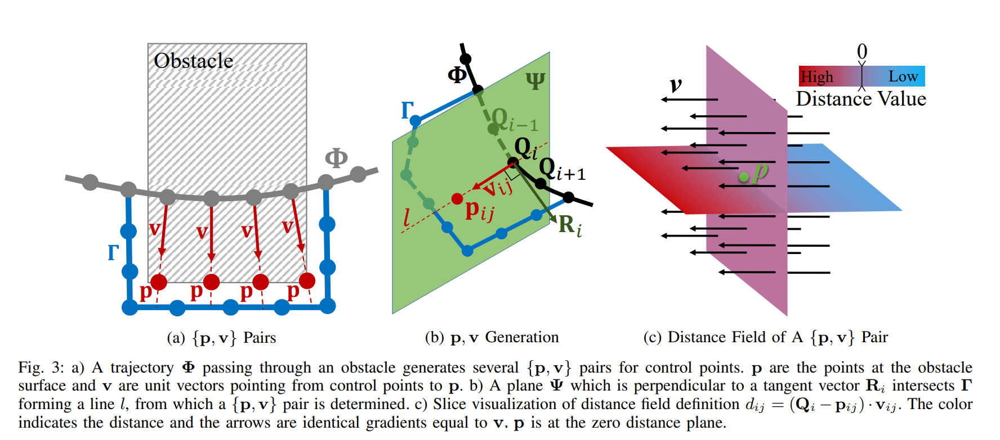
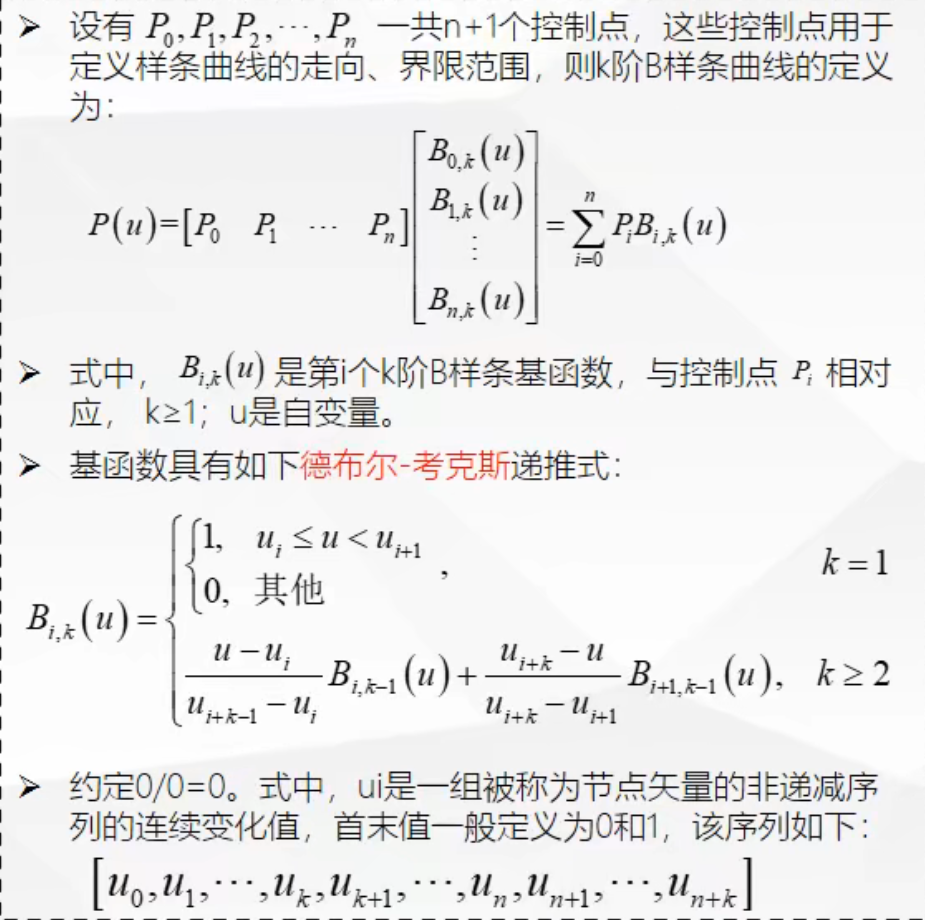
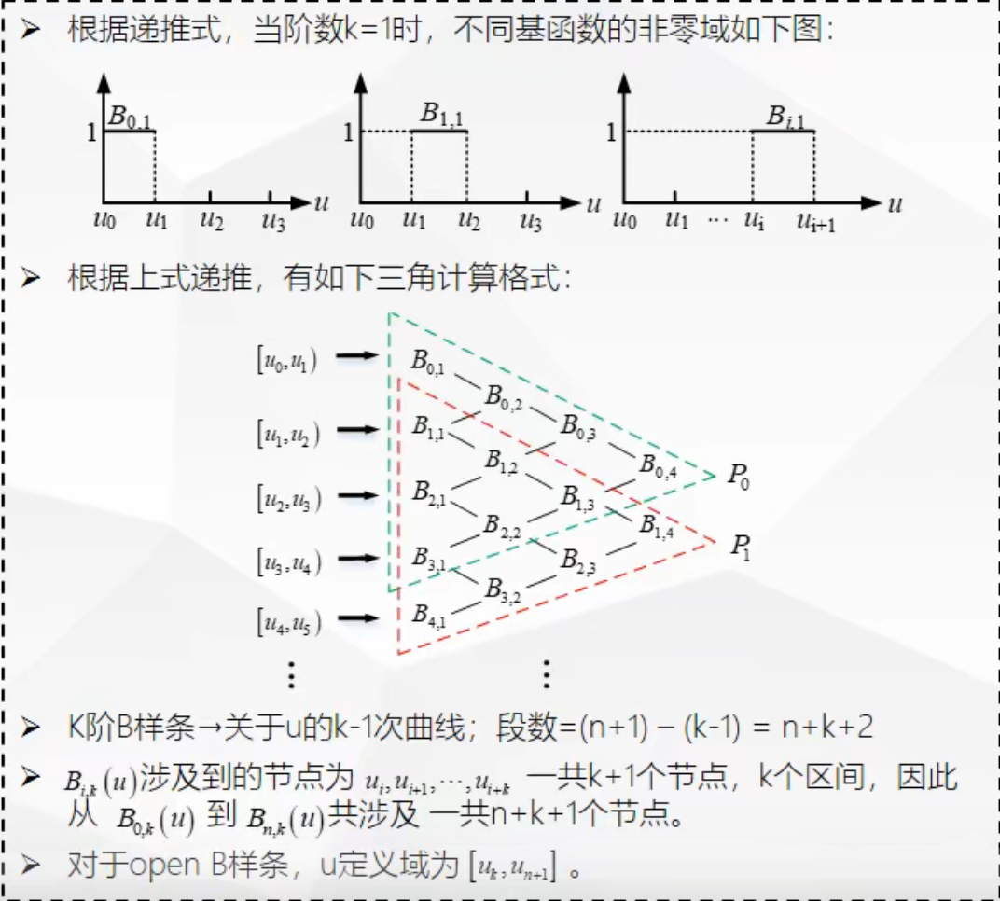
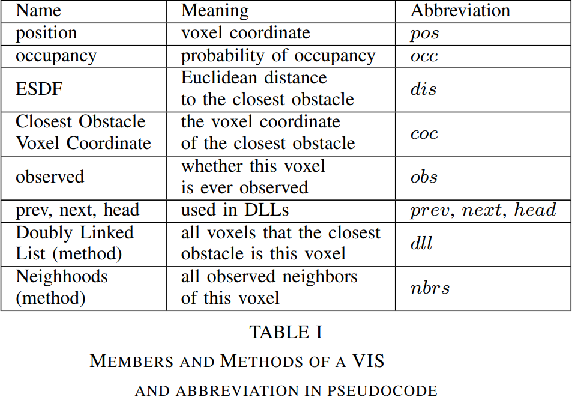
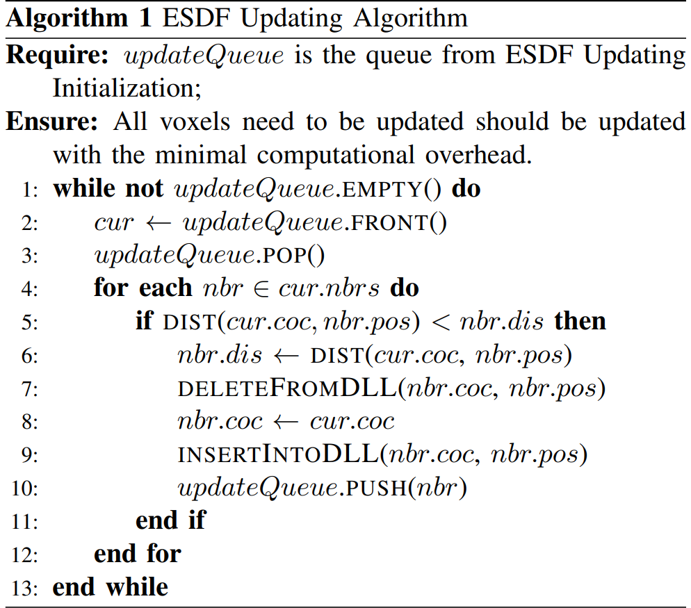
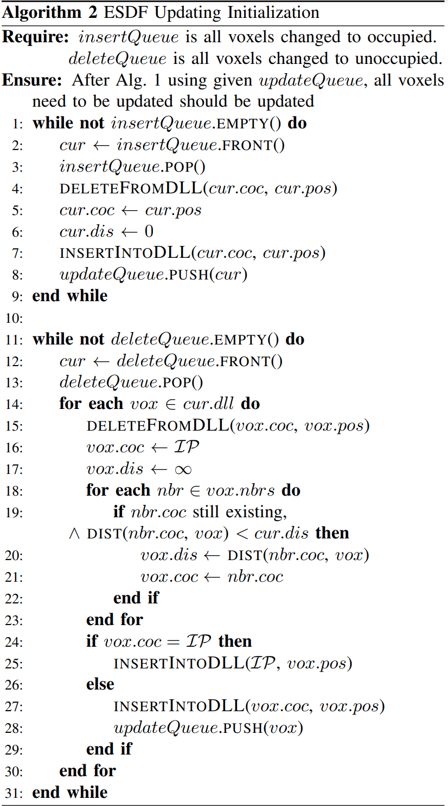

# PAPERS SUMMARY

## Elastic Tracker: A Spatio-temporal Trajectory Planner for Flexible Aerial Tracking

### abstracts

1. 一种遮挡感知的路径搜索方法和一种智能安全飞行走廊(SFC)生成策略。
2. 在不构造 ESDF 的情况下，利用所提出的路径搜索方法的结果对解析遮挡代价进行了评估。
3. 特别设计的配方，以避免遮挡和保持适当的视距。
4. 一种有效的轨迹优化方法能够在保证安全性和可视性的前提下生成时空最优轨迹

### points

- 就好像无人机和目标之间有一个无形的弹簧，既不分开，又可以根据情况灵活伸缩
- 分析遮挡代价评估是顺便的，降低了cost

### related

- G. Chen, W. Dong, X. Sheng, X. Zhu, and H. Ding, “Bio-inspired obstacle avoidance for flying robots with active sensing,” arXiv eprints, pp. arXiv–2010, 2020.
- J. Tordesillas and J. P. How, “Panther: Perception-aware trajectory planner in dynamic environments,” arXiv preprint arXiv:2103.06372, 2021.

## Evolutionary Artificial Potential Fields and Their Application in Real Time Robot Path Planning

### abstracts

新的实时机器人路径规划方法，称为进化人工势场（EAPF）。将人工势场法与遗传算法相结合，得出最优势场函数

### points

1. 在传统的人工势场方法中，障碍物被视为最高势点，目标被视为最低势点。在机器人路径规划领域，机器人总是从高电位点移动到低电位点
2. 在传统的人工势场函数方法中，不涉及优化过程。通过这种方法生成的路径是安全的，但不是最优的
3. 引入额外的“escape force”来解决局部极小值问题
4. 本文所提出的方法始终可以规划最佳的平滑路径，不论障碍物和目标点是静止还是移动

## Modified Artificial Potential Field Method for Online Path Planning Applications

### abstracts

- 改善传统APF的局部极小值问题
- 优点是计算时间较短，符合标准A星（A*）方法
- 根据电位梯度下降算法（PGDA）在电位场中寻找实际路径
- PGDA达到全局最小值时，将仅用一个与机器人最终目标匹配的最小值（全局最小值）构造一个新的势场

### points

- 只要正在进行的状态不同于全局最小值，就执行PGDA。如果它无法前进，陷入局部极小值，那么该算法会向当前状态添加一些额外的排斥势，直到它自由为止
- 这个添加的排斥势可以被保存，用于下一次规划中

## EGO-Planner: An ESDF-free Gradient-based Local Planner for Quadrotors

### abstracts

- 优化过程中的轨迹仅覆盖ESDF更新范围的非常有限的空间
- 该算法由基于梯度的样条优化器和后求精过程组成

### points

- 
- 以{p,v}对的p点作为0距离点,沿着v的方向为正轴(借此构建欧几里得符号场?)
  - 距离dij定义在Qi和不同的{p,v}j上,是前者在后者上的投影
- 如果一个控制点Qi满足所有dij>0,则它所在的障碍物会被视为新发现的障碍物
  - 此举减少了不必要的轨迹优化
- 轨迹由控制点Q生成,速度.加速度.急动度全部由相邻Q在单位时间上的变化率依次求得
- 轨迹会迭代若干次直至稳定在一个安全路径
- 急动度由三个惩罚公式按一定比例线性组合而成(通过调整系数可以得到不同偏好的路径)
  - 急动度惩罚是为了让轨迹更平滑
  - 碰撞惩罚会把控制点推离障碍物,从而规划出安全的路径
    - 规定一个安全间隙sf,对于距离小于该间隙的控制点给予惩罚
    - 不同的

### questions

- jerk是指冲量?
  - 叫做急动度(加速度a和力F成正比,但是对于实际的无人机,推力的改变速率也是有限的,为了动力学可行性,需要jerk)
  - 从无人机的角度来看,它需要知道在多少时间内把油门从多少调整到多少
- {p,v}对是如何影响轨迹的?
  - 通过影响控制点来影响轨迹

### related

- B样条曲线
  - 三大要素：节点，控制点，阶次
    - 节点是一组单调不减的数字,一般范围是0-1
    - 控制点和贝塞尔曲线的控制点一样,B样条能够保证绘制的曲线包裹在控制点内
  - 只需要通过修改t值，就可以表述任意曲线上的任意点
  - 移动控制点仅仅改变曲线的部分形状，而不改变整体
  - 具有凸包性质
  - 
  - 
  - 均匀B样条曲线:节点沿着参数轴均匀分布,此时所有基函数具有相同形状,每个后续基函数只是前面基函数的重复
  - 准均匀B样条曲线:两端节点均匀分布,中间非递减,比如U={0,0,0,1,2,3,4,5,5,5}
  - 猜想:B样条曲线是为了用幂函数模拟不同的曲线而发明,次数越高,模拟的精度越高?

## FIESTA: Fast Incremental Euclidean Distance Fields for Online Motion Planning of Aerial Robots

### abstracts

- 提出了一个称为FIESTA的映射系统来逐步构建全局ESDF映射
- 通过引入两个独立的更新队列分别插入和删除障碍物，并使用索引数据结构和双链表进行地图维护
- 我们的算法使用BFS框架更新尽可能少的节点
- 我们的ESDF映射具有较高的计算性能，并产生接近最优的结果
- 通过理论和实验证明，我们的方法在性能和准确性方面优于其他最新方法

### points

- 
- 
- 
- B样条曲线的控制点投射到障碍物上形成{p,v}对