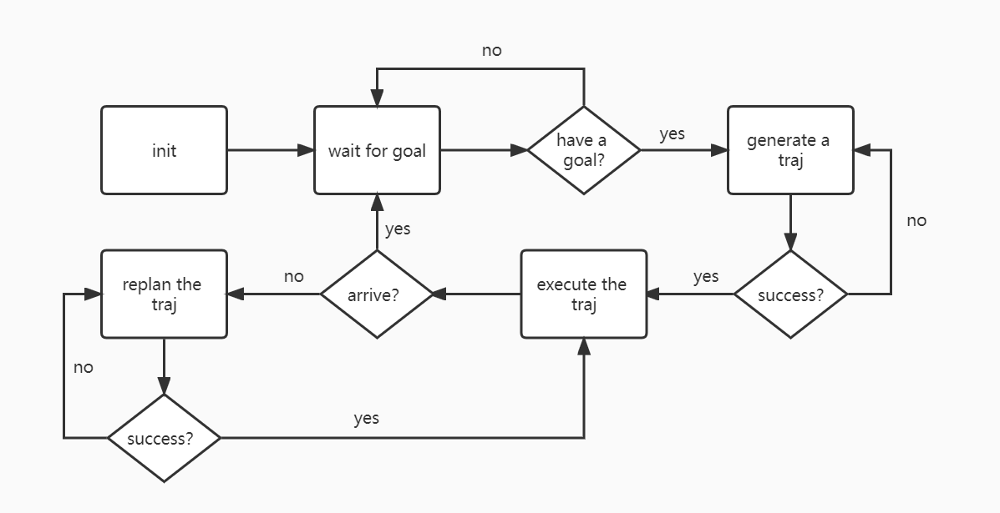

# SOURCE CODE READING

## Prometheus

### 基本结构

### `Prometheus\Modules\simulator_utils\include\map_generator.cpp`
- 提供了几种基本的地图格式
    ```cpp
    pcl::PointCloud<pcl::PointXYZ> global_map_pcl; // 全局点云地图 - pcl格式
    sensor_msgs::PointCloud2 global_map_ros;       // 全局点云地图 - ros_msg格式
    pcl::PointCloud<pcl::PointXYZ> local_map_pcl;  // 局部点云地图 - pcl格式
    sensor_msgs::PointCloud2 local_map_ros;        // 局部点云地图 - ros_msg格式
    pcl::KdTreeFLANN<pcl::PointXYZ> kdtreeLocalMap;
    ```
- 借助几个基本的图形生成函数(圆柱,直线,方形等)生成随机地图
- 定时发布点云信息（pcl）`/map_generator/local_cloud`
- 点云信息可以被rviz订阅，生成可视化图
- 点云还可以被寻路算法订阅，用于计算轨迹    

### `Prometheus\Modules\simulator_utils\quadrotor_dynamics\quadrotor_dynamics.cpp`

- 记录了无人机的详细参数
    ```c++
    struct State
    {
      Eigen::Vector3d pos;      // 位置
      Eigen::Vector3d vel;      // 速度
      Eigen::Matrix3d R;        // 旋转矩阵
      Eigen::Vector3d omega;    // 角速度
      Eigen::Array4d motor_rpm; // 电机转速
      EIGEN_MAKE_ALIGNED_OPERATOR_NEW;
    };
    ```
- 提供重设这些参数的接口

### `Prometheus\Modules\simulator_utils\include\fake_uav.h`

- 列出了无人机订阅和发布的话题
  ```c++
    // 订阅
    ros::Subscriber pos_cmd_sub;
    ros::Subscriber att_cmd_sub;
    ros::Subscriber ego_cmd_sub;
    ros::Publisher fake_odom_pub;

    // todo 参看estimator
    ros::Publisher uav_state_pub;
    ros::Publisher uav_odom_pub;
    ros::Publisher uav_trajectory_pub;
    ros::Publisher uav_mesh_pub;
    ```

### `Prometheus\Modules\simulator_utils\quadrotor_dynamics\quadrotor_dynamics.cpp`

- 无人机的动力驱动，比较底层

### `Prometheus\Modules\tutorial_demo\basic`

- 本文件夹提供了一些基本的创建、控制无人机的示例
- 可以通过指定无人机xyz方向上的速度控制移动，也可以直接指定位置的ENU坐标或者经纬度
- 所有控制信息被封装在一个uav_command.msg里面，通过`"/uav" + std::to_string(uav_id) + "/prometheus/command"`话题发布
- 无人机命令有两大类，控制和移动
    ```c++
    ## 控制命令的模式 
    uint8 Agent_CMD
    # Agent_CMD 枚举
    uint8 Init_Pos_Hover=1  # home点上方悬停
    uint8 Current_Pos_Hover=2 # 当前位置上方悬停
    uint8 Land=3
    uint8 Move=4
    uint8 User_Mode1=5

    ## 移动命令下的子模式
    uint8 Move_mode
    ## 移动命令下的子模式枚举
    uint8 XYZ_POS = 0               ### 惯性系定点控制
    uint8 XY_VEL_Z_POS = 1          ### 惯性系定高速度控制
    uint8 XYZ_VEL = 2               ### 惯性系速度控制
    uint8 XYZ_POS_BODY = 3          ### 机体系位置控制
    uint8 XYZ_VEL_BODY = 4          ### 机体系速度控制
    uint8 XY_VEL_Z_POS_BODY = 5     ### 机体系定高速度控制
    uint8 TRAJECTORY = 6            ### 轨迹追踪控制
    uint8 XYZ_ATT = 7               ### 姿态控制（来自外部控制器）
    uint8 LAT_LON_ALT = 8           ### 绝对坐标系下的经纬度
    ```
### `Prometheus\Modules\tutorial_demo\advance`

- 含有一些进阶案例，比如自动寻找平面上的二维码并降落在上面
- 考虑把它和自动寻路算法结合，以此作为目标追踪的原形
- 目前避障模块还有一些问题，打算对比ego-planner修改适配，关键点就在于那个map_generator模块

### `Prometheus\Modules\motion_planning\local_planner`


### `Prometheus\Modules\motion_planning\local_planner`

- 实际上包含了两个势场算法apf和vfh(都通过计算合力获取速度)
- 输入：从传感器获取当前的位置、局部地图、局部点云，目标位置；输出：期望速度
    ``` c++
    sensor_msgs::PointCloud2ConstPtr &local_map_ptr //局部地图(实际计算中没有使用)
    pcl::PointCloud<pcl::PointXYZ>::Ptr &pcl_ptr //局部点云(用于计算)
    nav_msgs::Odometry cur_odom //本地位置
    Eigen::Vector3d &goal //目标位置
    Eigen::Vector3d &desired_vel //期望速度
    ```
- 应该是定时读取传感器并实时修改速度，算法效果估计不优秀

### `Prometheus\Scripts\simulation\motion_planning\apf_with_local_pcl.sh`

- 以此脚本为例，实现了一个apf自动寻路
- 运行模拟寻路算法的主要流程
   1. 启动gazebo，根据gazebo的世界创建点云地图
      1. 调用了map_generator，
   2. 启动px4，配置模拟无人机的相关参数
   3. 启动控制节点和虚拟摇杆驱动
      1. 控制节点负责把期望速度
   4. 启动寻路算法节点
      1. 该部分可以配置诸如安全距离、感知距离、膨胀参数等参数
      ```xml
        <!-- 参数 -->
        <param name="uav_id" value="1"/>
        <param name="global_planner/sim_mode" value="true"/>
        <param name="global_planner/local_pcl_topic_name" value="/map_generator/local_cloud"/>
        <!-- 地图输入模式 0代表全局点云，1代表局部点云，2代表激光雷达scan数据 -->
        <param name="global_planner/map_input_source" value="1"/>
        <!-- 无人机飞行高度，建议与起飞高度一致 -->
        <param name="global_planner/fly_height" value="1.5"/>
        <!-- 路径追踪频率 -->
        <param name="global_planner/time_per_path" value="1.0"/>
        <!-- Astar重规划频率 -->       
        <param name="global_planner/replan_time" value="5.0"/>
        <!-- 地图参数 -->
        <param name="map/border" value="true"/>
        <param name="map/queue_size" value="5"/>
        <!-- 分辨率 -->
        <param name="map/resolution" value="0.2"/>
        <!-- 障碍物膨胀距离,建议为飞机的轴距1.5倍 -->
        <param name="map/inflate" value="0.4"/>
        <!-- 地图范围 -->
        <param name="map/origin_x" value="-15.0"/>
        <param name="map/origin_y" value="-15.0"/>
        <param name="map/origin_z" value="-0.5"/>
        <param name="map/map_size_x" value="30.0"/>
        <param name="map/map_size_y" value="30.0"/>
        <param name="map/map_size_z" value="3.0"/>
      ```

### `Prometheus/Modules/object_detection_yolov5tensorrt/yolov5_trt_ros.py`

- 订阅摄像头话题，交给YoloV5处理
- 实现了一个服务器，把预测结果发给客户端
- 创建了一个监视窗口，内容是摄像头的数据，会把识别框显示出来，并提供了点击识别框的功能
- 如果点击了一个识别框，就会启动siamRPN，开始追踪，此后的输入图像都交给siamRPn处理
- 两种情况公用一套传输模板：
    ```python
    # FrameID, 是否检测到目标(0/1,>1:num-of-objs), obj-order, 类别, x (0-1), y (0-1), w (0-1), h (0-1), 置信度, 0:detecting-mode
                    # 按照如下格式发送数据，实际上是字符串
                    client_socket.send('{:08d},{:03d},{:03d},{:03d},{:.3f},{:.3f},{:.3f},{:.3f},{:.3f},{:04d},{:04d},0'.format(
                        self.frame_cnt,
                        len(result_boxes),
                        i,
                        int(result_classid[i]),
                        box[0] / image_raw.shape[1],
                        box[1] / image_raw.shape[0],
                        (box[2]-box[0]) / image_raw.shape[1],
                        (box[3]-box[1]) / image_raw.shape[0],
                        result_scores[i],
                        int((box[0]+box[2])/2),
                        int((box[1]+box[3])/2)).encode('utf-8'))
    ```

### `Prometheus/Modules/object_detection/py_nodes/yolov5_tensorrt_client/yolov5_tensorrt_client.py`

- 实现了一个客户端，接收服务器的数据
- 如果是处于识别阶段，就把数据整合成MultiDetectionInfo.msg发布到`/prometheus/object_detection/yolov5_openvino_det`（识别时可能会有多个目标）
- 如果是追踪阶段，就把DetectionInfo.msg发布到`/prometheus/object_detection/siamrpn_tracker`

## EGO-PLANNER

### 基本结构
- plan_env：在线映射算法。它以深度图像（或点云）和相机姿态（里程计）对作为输入，进行光线投射以更新概率体积图，并为规划系统构建欧几里德符号距离场 (ESDF)。
- path_searching：前端路径搜索算法。目前它包括一个尊重四旋翼动力学的动力学路径搜索。它还包含一个基于采样的拓扑路径搜索算法，以生成多个拓扑独特的路径，这些路径可以捕捉 3D 环境的结构。
- bspline：基于 B 样条的轨迹表示的实现。
- bspline_opt：使用 B 样条轨迹的基于梯度的轨迹优化。
- active_perception：感知感知规划策略，使四旋翼能够主动观察并避开未知障碍物，在未来出现。
- plan_manage：调度和调用映射和规划算法的高级模块。这里包含启动整个系统的接口以及配置文件。
- 除了文件夹fast_planner，一个轻量级的uav_simulator用于测试。

### `ego-planner\src\planner\path_searching\src\dyn_a_star.cpp`

- 动态A\*寻路算法,又称D\*算法

  ```text
  初始化open_set和close_set；
  将起点加入open_set中，并设置优先级为0（优先级最高）；
  如果open_set不为空，则从open_set中选取优先级最高的节点n：
      如果节点n为终点，则：
          从终点开始逐步追踪parent节点，一直达到起点；
          返回找到的结果路径，算法结束；
      如果节点n不是终点，则：
          将节点n从open_set中删除，并加入close_set中；
          遍历节点n所有的邻近节点：
              如果邻近节点m在close_set中，则：
                  跳过，选取下一个邻近节点
              如果邻近节点m也不在open_set中，则：
                  设置节点m的parent为节点n
                  计算节点m的优先级
                  将节点m加入open_set中
    ```

- GridNodePtr

    ```cpp
    typedef GridNode *GridNodePtr;

    struct GridNode
    {
        enum enum_state
        {
            OPENSET = 1,
            CLOSEDSET = 2,
            UNDEFINED = 3
        };

        int rounds{0}; // Distinguish every call
        enum enum_state state
        {
            UNDEFINED
        };
        Eigen::Vector3i index;

        double gScore{inf}, fScore{inf};
        GridNodePtr cameFrom{NULL};
    };
    ```

  - ebum_state是地图点的三种类型，open代表可以走，closed代表不能走,undefined是D\*算法相比A\*多出来的部分，无人机边观察变填充地图数据
  - gScore是根据节点n距离起点的代价
  - fScore是节点n的综合优先级。当我们选择下一个要遍历的节点时，我们总会选取综合优先级最高（值最小）的节点
  - rounds用来区分每次调用?

- neighborPtr

- Eigen

### `ego-planner\src\planner\plan_env\src\grid_map.cpp`

- 空白

### `ego-planner\src\planner\plan_manage\src\ego_replan_fsm.cpp`

```c++
void execFSMCallback(const ros::TimerEvent &e);
```

- 实现了一个状态机，无人机始终在***起始、等待航点、规划路线、重新规划路线、执行路线、紧急停止***这几个状态间切换
- 

```c++
void EGOReplanFSM::checkCollisionCallback(const ros::TimerEvent &e);
```

- 总是根据当前轨迹继续规划,如果检测到碰撞就重新规划
- 规划失败的时候说明周围有障碍物,检测是否需要急停

```c++
bool EGOReplanFSM::callReboundReplan(bool flag_use_poly_init, bool flag_randomPolyTraj)
```

- 弹性规划，两个参数的具体含义不明，推测是跟轨迹随机初始化有关
- 轨迹规划的具体实现在planner_manage.cpp中
- 改变接收到的B样条数据格式并发布
  
```c++
bool planFromCurrentTraj();
```

- 沿当前路径规划，仅在周围没有障碍物的时候调用
- 会依次尝试调用callReboundReplan(false,false),(true,false),(true,true)全部失败才返回false

### `ego-planner\src\planner\plan_manage\src\planner_manager.cpp`

- 紧急停止函数就是简单地把轨迹的控制点全都设为同一个点
- 用到了Eigen库，大量使用了其中的Vector3d（也即三维向量）表示点、速度、加速度等，用它方便地计算了两个点的距离
- 本函数库与polynomial_traj.cpp以及plan_env/高度相关，只能读懂大概意思